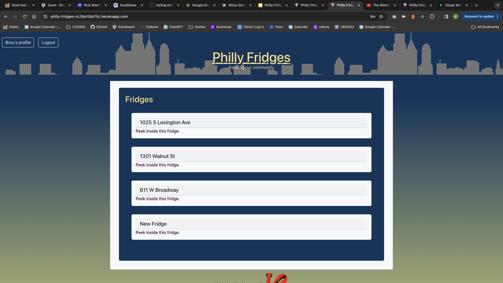
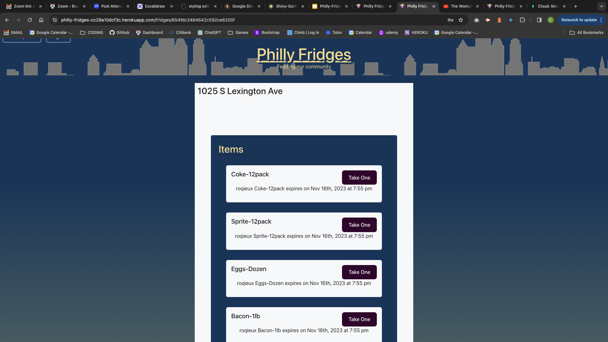

# Philly Fridges

## Description

Phree Philly Phridge is a application that helps our community locate refridgerators in their respective neighborhoods, that contain food that is free for all. The Fridge Project places refrigerators in predominately public spaces where individuals can donate excess food and others can freely take what they need.  It operates on a mutual aid basis, relying on the collective efforts of volunteers and donors to stock the fridge and make it accessible to those facing food insecurity.

Showcasing a React App with Authentication. MERN website that allows a user to create a login, add details of their fridges and food items, then remove a food item from the any respective fridge.. MongoDB, Express, React, Node. Hosted on Heroku.

Please visit this website to see our application:

[Deployed application](https://philly-fridges-cc29a10dcf3c.herokuapp.com/)
[Github Repository](https://github.com/brousy)

## Table of Contents
- [Languages Used](#languages-used)
- [Installation](#installation)
- [Credits](#credits)
- [Features & Screen Shots](#features--screen-shots)


 
## Languages Used:
* HTML
* CSS
* Bootstrap
* JavaScript
* React.js
* Create-React-App
* Express
* MongoDB
* Mongoose
* Express
* Node.js
* Heroku
* Github

## Installation
To set up the development environment and install necessary dependencies, navigate to the project's root directory and execute the following command:
```
npm install
```
To seed all of the information:
```
npm run seed
```

## Usage Information
To start the application, run the following command:
```
npm run develop
```
The application will be accessible at http://localhost:3000.


## Credits

Project Team Members:
    1. Julien Larroque
    2. Elizabeth Quinn
    3. Jude Hartmann
    4. Victor Marczy


## Features & Screen Shots
1. Sign up and Login to the Philly Fridges.

    

    

2. User Profile includes all of the fridges owned!

    
 
3. The ability to add new fridges within your profile. Marking it as online or offline. 
 
    

4. Features the ability to peak inside a fridge and see the items!
 
    

5. Features the ability to add items to the fridhe with quantity, frozen option and expiration date. 

    


## How to Contribute

